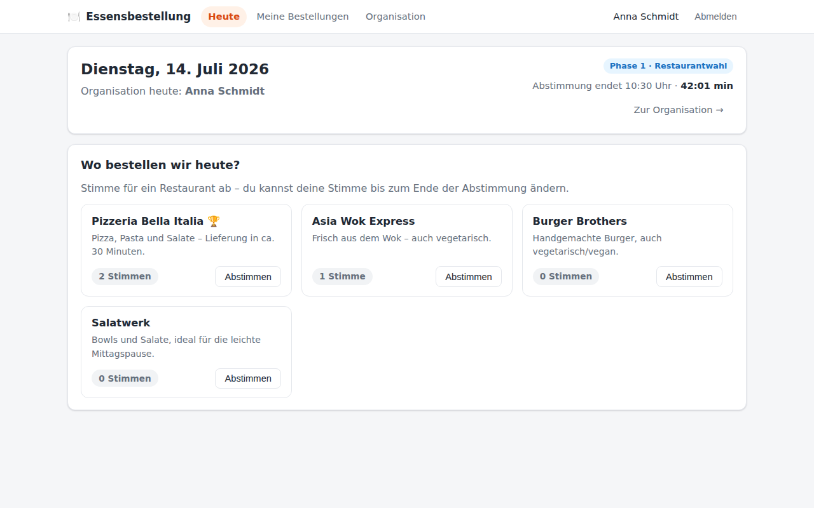
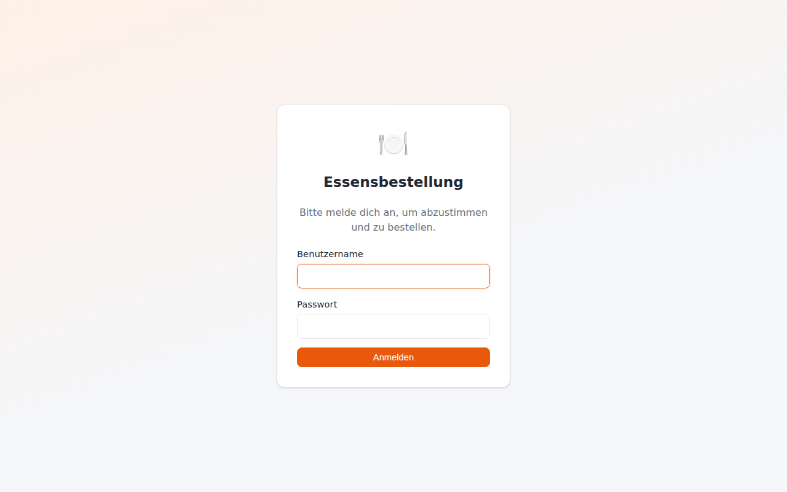
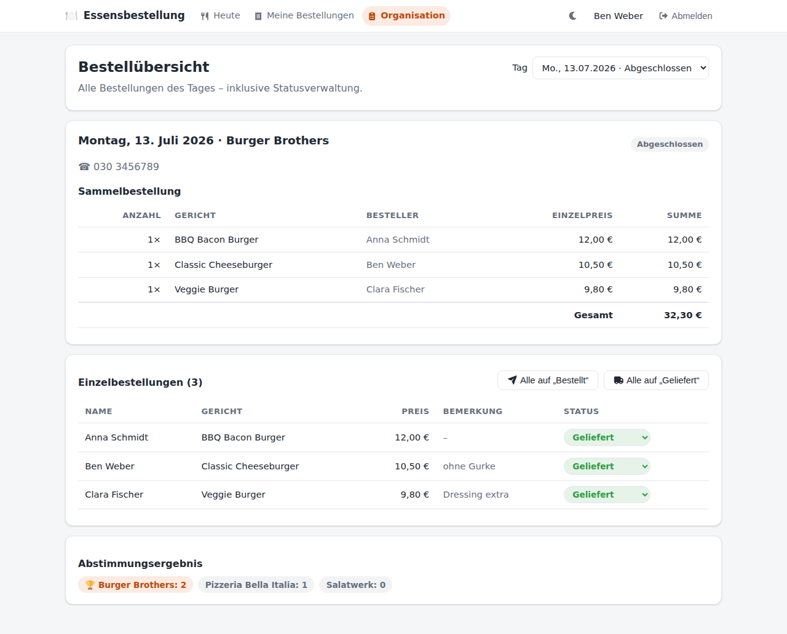
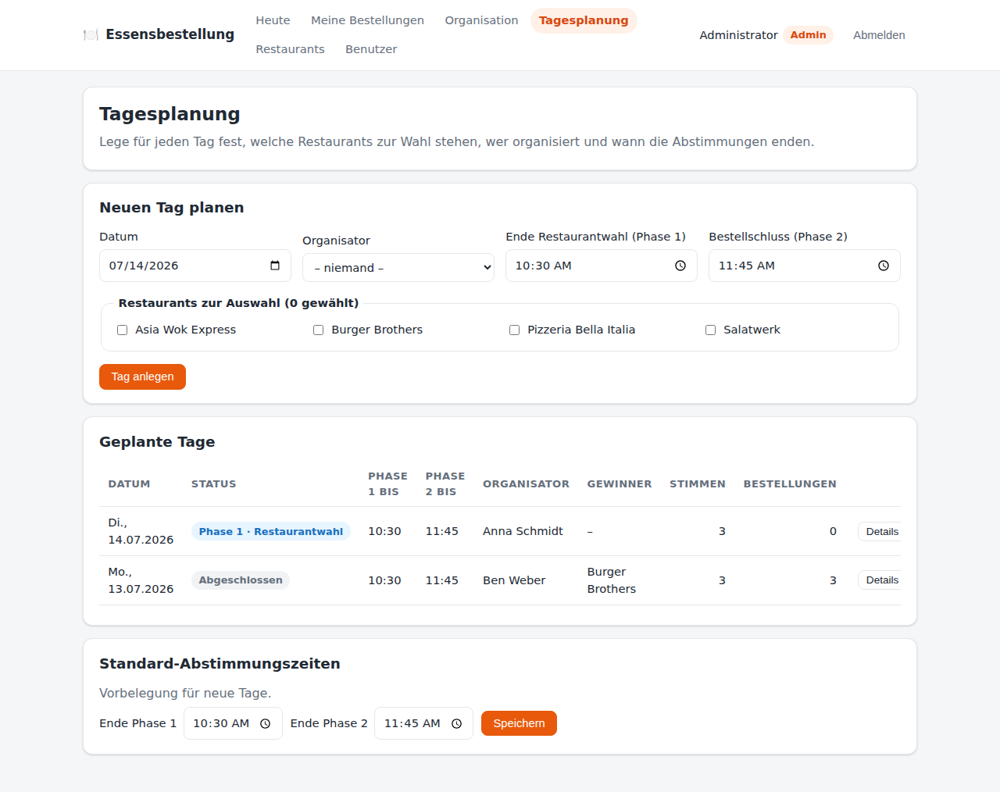
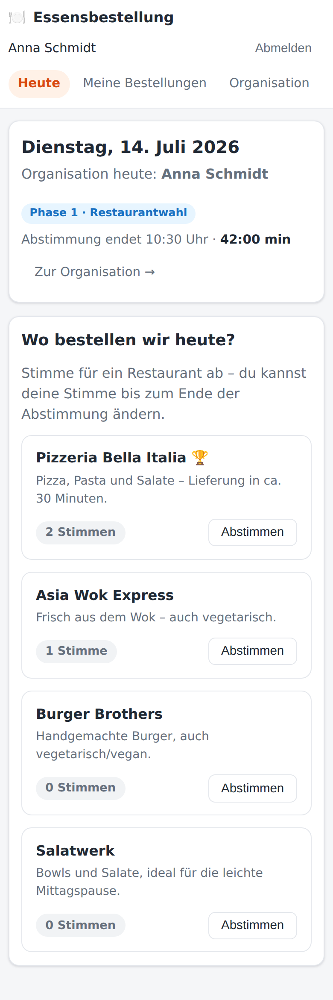

# 🍽️ Essensbestellung

Moderne Webanwendung zur Organisation täglicher Essensbestellungen im Team – mit
**Zwei-Phasen-Abstimmung**: Erst wählt das Team das Restaurant, dann bestellt jeder sein
Gericht. Phasenwechsel passieren **automatisch** zu den vom Administrator festgelegten
Uhrzeiten.



## Funktionsweise

**Phase 1 – Restaurantwahl:** Der Admin plant für jeden Tag die zur Wahl stehenden
Restaurants, den Organisator und die Abstimmungszeiten. Bis zum Ende von Phase 1 stimmt
jeder Mitarbeiter für ein Restaurant (Stimme jederzeit änderbar). Nach Ablauf gewinnt
automatisch das Restaurant mit den meisten Stimmen (bei Gleichstand die zuerst gelistete
Option).

**Phase 2 – Essensauswahl:** Direkt im Anschluss wird die Speisekarte des Gewinners
freigeschaltet. Bis zum Bestellschluss wählt jeder sein Gericht und kann eine Bemerkung
hinterlassen („ohne Zwiebeln“). Danach ist der Tag abgeschlossen.

**Organisation:** Der für den Tag bestimmte Organisator sieht die vollständige
Bestellübersicht – als nach Gerichten gruppierte Sammelbestellung mit Summen und als
Einzelliste – und pflegt den Bestellstatus (Eingegangen → Bestellt → Geliefert,
Storniert; einzeln oder als Sammelaktion).

## Rollen

| Rolle | Möglichkeiten |
| --- | --- |
| **Benutzer** | Anmelden, an beiden Abstimmungen teilnehmen, eigenes Essen wählen, eigene Bestellungen einsehen |
| **Planung** | Zusätzlich: Tage anlegen, bearbeiten und absagen sowie die Planungs-Standardzeiten pflegen – **ohne** Zugriff auf Benutzer-, Restaurant-, Design- oder SSO-Verwaltung |
| **Organisator** | Zusätzlich (für „seinen“ Tag): alle Bestellungen einsehen, Bestellstatus verwalten, Sammelbestellung |
| **Administrator** | Vollständige Verwaltung: Benutzer, Restaurants und Speisekarten, Tagesplanung, Standardzeiten, Design/Branding, SSO, alle Ergebnisse |

## Tech-Stack

- **Frontend:** React 18 + Vite, React Router, responsives CSS (Desktop & Mobil)
- **Backend:** Node.js + Express, JWT-Authentifizierung, bcrypt-Passwort-Hashing
- **Datenbank:** SQLite (better-sqlite3) – ohne externe Dienste sofort lauffähig

## Schnellstart

Voraussetzung: Node.js ≥ 20.

```bash
npm run setup   # installiert Root-, Server- und Client-Abhängigkeiten
npm run seed    # legt Demo-Daten an (Benutzer, Restaurants, Beispieltage)
npm run dev     # startet Backend (Port 3001) und Frontend (Port 5173)
```

Anschließend <http://localhost:5173> öffnen und anmelden:

| Benutzername | Passwort | Rolle |
| --- | --- | --- |
| `admin` | `admin123` | Administrator |
| `anna` | `passwort123` | Benutzerin (heute Organisatorin) |
| `ben` | `passwort123` | Benutzer (Organisator des Beispieltags von gestern) |
| `clara` | `passwort123` | Benutzerin |

Der Seed legt einen laufenden Tag in Phase 1 sowie einen abgeschlossenen Vortag mit
Bestellungen an. Liegen die Standardzeiten (10:30/11:45) beim Seeden bereits in der
Vergangenheit, werden die Demo-Deadlines automatisch relativ zur aktuellen Uhrzeit
gesetzt, damit Phase 1 aktiv ist.

**Produktionsbetrieb:**

```bash
npm run build   # baut das Frontend nach client/dist
npm start       # Express liefert API + Frontend gemeinsam auf Port 3001 aus
```

Konfiguration über Umgebungsvariablen: `PORT` (Standard 3001), `JWT_SECRET`
(sonst automatisch generiert und in `server/data/` abgelegt), `APP_TIMEZONE`
(Standard `Europe/Berlin`). Der Server lädt zusätzlich `server/.env`, das
Frontend `client/.env` (Vorlagen: `*.env.example`).

**HTTPS/TLS (empfohlen):** Der Server liefert unverschlüsseltes HTTP aus und
sollte in Produktion **hinter einem TLS-terminierenden Reverse-Proxy**
(nginx, Caddy, Traefik o. Ä.) betrieben werden. Der Proxy muss
`X-Forwarded-Proto` setzen – dann sendet die App automatisch den
`Strict-Transport-Security`-Header (HSTS) und erkennt HTTPS korrekt. Die Zahl
der vertrauenswürdigen Proxy-Hops lässt sich über `TRUST_PROXY_HOPS` (Standard 1)
anpassen. Ein Betrieb ohne TLS ist nur in abgeschotteten internen Netzen
vertretbar. Sicherheits-Header (CSP, X-Frame-Options, nosniff, Referrer-Policy)
setzt die App selbst.

**Single Sign-On (optional):** Anmeldung über Microsoft Entra ID (Azure AD)
per MSAL – ohne Client-Secret, über eine **Verbundanmeldeinformation**
(Federated Identity Credential). Die Konfiguration (Client-ID, Tenant-ID,
Verbundanmeldung) erfolgt direkt in der App unter **Admin → Anmeldung (SSO)**
inkl. „Verbindung testen"; Einrichtung und benötigte Azure-Werte siehe
[docs/sso-entra-id.md](docs/sso-entra-id.md). Ohne Konfiguration bleibt die
lokale Anmeldung aktiv. Dark Mode und Branding (Logo, Favicon, Farbschema)
konfiguriert der Admin direkt in der App unter **Design**.

## Automatische Installation auf Ubuntu Server

Das Skript [`install-essen-nigefa.sh`](install-essen-nigefa.sh) richtet die App auf
einem Ubuntu Server vollautomatisch als Dienst ein – inklusive Node.js-Installation,
Frontend-Build, Datenbank und **systemd-Dienst mit Autostart**. Es müssen keine Dienste
manuell angelegt werden.

```bash
git clone https://gitlab.nigefa.de/t.sattler/essensportal.git
cd Essenbestellung-NIGEFA
sudo bash install-essen-nigefa.sh
```

Das Skript installiert nach `/opt/essen-nigefa`, legt den Systembenutzer `essen` an,
erzeugt ein persistentes JWT-Secret unter `/etc/essen-nigefa/` und startet den Dienst
`essen-nigefa`. Danach ist die App unter `http://<server-ip>:3001/` erreichbar.

Anpassbar über Umgebungsvariablen, z. B. `sudo PORT=8080 APP_TIMEZONE=Europe/Vienna bash install-essen-nigefa.sh`
(`INSTALL_DIR`, `SERVICE_USER`, `SERVICE_NAME`, `PORT`, `APP_TIMEZONE`, `NODE_MAJOR`,
`RUN_SEED`).

```bash
systemctl status essen-nigefa       # Status ansehen
journalctl -u essen-nigefa -f       # Logs verfolgen
systemctl restart essen-nigefa      # neu starten
sudo bash install-essen-nigefa.sh uninstall   # Dienst entfernen
```

**Updates:** Für bestehende Installationen gibt es
[`update-essen-nigefa.sh`](update-essen-nigefa.sh) – im aktualisierten
Repository ausführen:

```bash
git pull                            # oder frisch klonen
sudo bash update-essen-nigefa.sh
```

Das Skript legt **vor dem Update automatisch ein Backup** an (Datenbank,
Branding-Dateien, JWT-Secret, Dienst-Konfiguration – ablegt unter
`/opt/essen-nigefa/backups/`), aktualisiert den Code, baut das Frontend neu
und führt **additive Datenbankmigrationen** aus (neue Spalten mit sinnvollen
Standardwerten, keine destruktiven Änderungen). Restaurants samt Speisekarten,
Benutzerkonten, Bestellhistorie und Branding-Einstellungen bleiben erhalten.
Am Ende zeigt eine Zusammenfassung Version, Migrationen, Backup-Pfad und den
Befehl zur Wiederherstellung im Fehlerfall.

## Dokumentation

| Dokument | Inhalt |
| --- | --- |
| [docs/datenbankmodell.md](docs/datenbankmodell.md) | Tabellen, ER-Diagramm, Statuslogik der Phasen |
| [docs/seitenkonzept.md](docs/seitenkonzept.md) | Alle Seiten, Abläufe und Berechtigungen |
| [docs/api-endpunkte.md](docs/api-endpunkte.md) | REST-API-Referenz mit Beispielen |
| [docs/sso-entra-id.md](docs/sso-entra-id.md) | Single Sign-On mit Microsoft Entra ID einrichten (optional) |
| [docs/speisekarten-import.md](docs/speisekarten-import.md) | Speisekarten importieren: CSV, Lieferando, Gastromia |

## Projektstruktur

```
├── server/                  Node.js/Express-Backend
│   └── src/
│       ├── index.js         App-Setup, Routen-Mounting, statisches Frontend
│       ├── db.js            SQLite-Schema und -Zugriff
│       ├── auth.js          JWT-Erstellung, Auth-/Admin-Middleware
│       ├── dayLogic.js      Phasenübergänge & Gewinnerermittlung
│       ├── util.js          Zeitzonen-Helfer (Europe/Berlin)
│       ├── seed.js          Demo-Daten
│       └── routes/          auth, users, restaurants, days, my, settings
├── client/                  React-Frontend (Vite)
│   └── src/
│       ├── App.jsx          Routing inkl. Rollen-Guards
│       ├── api.js           Fetch-Wrapper mit Token-Handling
│       ├── auth/            AuthContext (Login/Session)
│       ├── components/      Layout (Navigation), Countdown
│       └── pages/           Login, Heute, Meine Bestellungen, Organisation,
│                            admin/ (Tagesplanung, Restaurants, Benutzer)
├── docs/                    Konzepte, API-Referenz, Screenshots
├── install-essen-nigefa.sh  Automatische Ubuntu-Installation als systemd-Dienst
└── update-essen-nigefa.sh   Update bestehender Installationen (mit Backup + Migrationen)
```

## Wichtige Implementierungsdetails

- **Automatische Phasenwechsel:** Der Status eines Tages wird bei jedem Zugriff und
  zusätzlich alle 30 Sekunden aus den Deadlines abgeleitet; der Gewinner wird beim
  Übergang eingefroren. Kein Cron, keine externen Abhängigkeiten.
- **Automatische Tagesplanung (Mo–Fr):** Optional legt die App Tage im Voraus an –
  je Wochentag ein festes oder rotierendes Restaurant-Angebot, konfigurierbarer
  Vorlauf, Wochenenden werden ausgelassen, Feiertage als Datumsliste pflegbar.
  Die Erzeugung ist idempotent (bestehende Tage bleiben unangetastet und manuell
  editierbar) und läuft beim Start sowie regelmäßig; Konfiguration unter
  **Tagesplanung → Automatische Tagesplanung**.
- **Live-Erlebnis im Frontend:** Die „Heute“-Seite pollt alle 15 Sekunden, der Countdown
  gleicht sich über `serverNow` mit der Server-Uhr ab und lädt beim Ablauf sofort neu –
  der Phasenwechsel erscheint ohne manuelles Neuladen.
- **Eine Stimme / eine Bestellung pro Tag** wird per UNIQUE-Constraint in der Datenbank
  garantiert; erneutes Abstimmen/Bestellen aktualisiert per Upsert.
- **Historie bleibt erhalten:** Restaurants und Gerichte, die bereits verwendet wurden,
  werden beim „Löschen“ deaktiviert statt entfernt.
- **Sicherheit:** bcrypt-Hashes, JWT mit 12 h Laufzeit, rollenbasierte Middleware,
  Organisator-Rechte gelten nur für den jeweils zugewiesenen Tag.

## Screenshots

| | |
| --- | --- |
|  |  |
|  |  |
