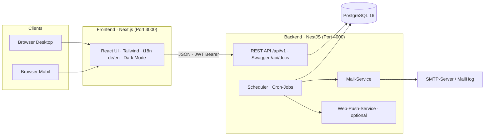
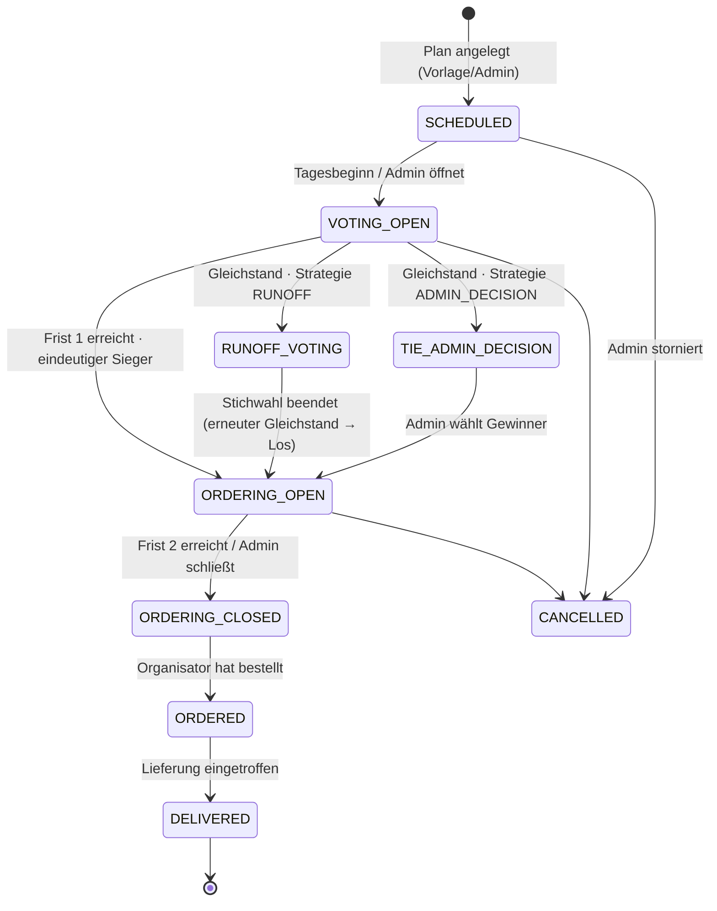

# Software-Architektur — NIGEFA Essensbestellung

## 1. Überblick

Die Anwendung ist als klassische **Client-Server-Architektur** mit klarer Trennung von Frontend, Backend und Datenbank aufgebaut. Alle Komponenten sind containerisiert und über Docker Compose orchestrierbar.



### Komponenten

| Komponente | Technologie | Verantwortung |
|---|---|---|
| Frontend | Next.js (App Router), React, TypeScript, Tailwind CSS, TanStack Query | Darstellung, Abstimmungs-/Bestell-UI, Admin-Dashboard, i18n, Dark Mode |
| Backend | NestJS, TypeScript, TypeORM | Geschäftslogik, REST-API, RBAC, Abstimmungs-Zustandsmaschine, Exporte |
| Scheduler | `@nestjs/schedule` (im Backend-Prozess) | Fristen schließen, Gewinner ermitteln, Tagespläne generieren, Erinnerungen |
| Datenbank | PostgreSQL 16 | Persistenz aller Daten |
| Mail | Nodemailer → SMTP (Prod) / MailHog (Dev) | E-Mail-Benachrichtigungen (de/en) |
| Push | `web-push` (VAPID), optional | Browser-Push-Benachrichtigungen |

## 2. Clean Architecture im Backend

Das Backend folgt einer pragmatischen Clean Architecture mit klar getrennten Schichten. Abhängigkeiten zeigen ausschließlich nach innen:

```
┌──────────────────────────────────────────────────────────┐
│  Presentation      Controller, DTOs, Guards, Swagger     │
│  ──────────────────────────────────────────────────────  │
│  Application       Services (Use Cases), Scheduler-Jobs  │
│  ──────────────────────────────────────────────────────  │
│  Domain            Entities, Enums, Geschäftsregeln      │
│  ──────────────────────────────────────────────────────  │
│  Infrastructure    Repositories (TypeORM), Mail, Push,   │
│                    PDF/Excel-Export, Konfiguration       │
└──────────────────────────────────────────────────────────┘
```

- **Controller** validieren Eingaben (class-validator-DTOs), prüfen Berechtigungen (Guards) und delegieren an Services. Sie enthalten keine Geschäftslogik.
- **Services** implementieren die Use Cases (z. B. „Abstimmung schließen und Gewinner ermitteln"). Sie kennen keine HTTP-Details.
- **Repositories** kapseln den Datenzugriff (**Repository Pattern**). Für die zentralen Aggregate (`DayPlan`, `Order`) existieren eigene Repository-Klassen mit fachlichen Abfragen (`findTodayWithRelations`, `tallyVotes`, …); einfache CRUD-Zugriffe nutzen die generischen TypeORM-Repositories.
- **Entities** bilden das Domänenmodell ab (siehe [02-datenmodell-erd.md](02-datenmodell-erd.md)).

### Fachmodule (NestJS-Module)

| Modul | Inhalt |
|---|---|
| `auth` | Registrierung, Login, JWT Access/Refresh, Passwortwechsel |
| `users` | Benutzerverwaltung (Admin), eigenes Profil, DSGVO-Anonymisierung |
| `restaurants` | Restaurants/Lieferdienste + Speisekarten (CRUD, Menü-Import-Adapter) |
| `planning` | Tagespläne, Wochenvorlagen, manuelle Statusaktionen, Zusammenfassung, Export |
| `voting` | Stimmabgabe, Auszählung, Gleichstands-Logik (Stichwahl/Admin) |
| `orders` | Essensbestellungen der Benutzer, Historie |
| `notifications` | In-App-Benachrichtigungen, Mail-Service, Web-Push |
| `stats` | Dashboard-Kennzahlen und persönliche Statistiken |
| `settings` | Globale Konfiguration (Fristen, Gleichstands-Strategie, Zeitzone …) |
| `audit` | Audit-Log aller Admin-Aktionen |
| `scheduler` | Cron-Jobs (Fristen, Generierung, Erinnerungen) |
| `health` | Healthcheck für Container-Orchestrierung |

## 3. Tagesablauf & Zustandsmaschine

Jeder Tag wird durch einen `DayPlan` repräsentiert, der eine Zustandsmaschine durchläuft:



### Phase 1 — Restaurant-Abstimmung

1. Der Tagesplan enthält die vom Admin (bzw. der Wochenvorlage) festgelegten Restaurant-Optionen.
2. Jeder Benutzer gibt **genau eine Stimme** ab und kann sie bis zur Frist ändern.
3. Bei Fristablauf (`voteDeadline`, z. B. 10:00 Uhr) zählt der Scheduler aus:
   - **Eindeutiger Sieger** → Status `ORDERING_OPEN`, Benachrichtigung „Phase 2 gestartet" an alle.
   - **Gleichstand** → konfigurierbare Strategie (global in den Einstellungen, pro Tag überschreibbar):
     - `RUNOFF`: Stichwahl nur zwischen den gleichauf liegenden Restaurants für `runoffMinutes` (Standard 15 min). Bei erneutem Gleichstand entscheidet das Los (dokumentiert im Audit-Log).
     - `ADMIN_DECISION`: Status `TIE_ADMIN_DECISION`; Administratoren werden benachrichtigt und wählen den Gewinner manuell.
4. Keine einzige Stimme abgegeben → der Plan wechselt zu `CANCELLED` (Benachrichtigung an Admin).

### Phase 2 — Essensbestellung

1. Mit `ORDERING_OPEN` können Benutzer Gerichte des Gewinner-Restaurants wählen: **Gericht, Menge, Bemerkung** (z. B. „ohne Zwiebeln"). Mehrere Positionen pro Person sind erlaubt; Änderungen bis zur Frist möglich.
2. Bei Fristablauf (`orderDeadline`, z. B. 11:30 Uhr) → `ORDERING_CLOSED`; der Organisator des Tages erhält die Zusammenfassung als Erinnerung.
3. Der Organisator bestellt beim Restaurant, setzt den Status auf `ORDERED` und später `DELIVERED` und kann einen Kommentar hinterlassen (z. B. „Lieferung ca. 12:30"). Statuswechsel benachrichtigen alle Besteller.

## 4. Scheduler-Jobs

Alle Jobs laufen minütlich bzw. zu festen Zeiten, sind **idempotent** und rechnen in der konfigurierten Zeitzone (Standard `Europe/Berlin`):

| Job | Zeitpunkt | Aufgabe |
|---|---|---|
| `generateDayPlan` | täglich 00:05 + beim App-Start | Erzeugt den heutigen Plan aus der Wochenvorlage, falls kein Plan existiert |
| `openVoting` | minütlich | `SCHEDULED` → `VOTING_OPEN` am Plantag, Benachrichtigung Phase 1 |
| `closeVoting` | minütlich | Frist 1 abgelaufen → Auszählung, Gleichstands-Logik, Phase-2-Start |
| `closeRunoff` | minütlich | Stichwahl-Frist abgelaufen → Auszählung (ggf. Losentscheid) |
| `closeOrdering` | minütlich | Frist 2 abgelaufen → `ORDERING_CLOSED`, Organisator-Erinnerung mit Zusammenfassung |
| `sendReminders` | minütlich | `reminderLeadMinutes` vor jeder Frist: Erinnerung an alle, die noch nicht gewählt/bestellt haben |

Manuelle Admin-Aktionen (`open-voting`, `close-voting`, `close-ordering`, `decide-winner`, `cancel`) nutzen dieselben Service-Methoden wie der Scheduler — eine Logik, zwei Auslöser.

## 5. Authentifizierung & Autorisierung (RBAC)

- **JWT-Authentifizierung**: kurzlebiger Access Token (15 min) + Refresh Token (7 Tage, Rotation, gehasht in DB gespeichert, widerrufbar bei Logout).
- Passwörter mit **bcrypt** (Kostenfaktor 12) gehasht.
- **Rollenmodell**:
  - `USER` — abstimmen, bestellen, eigene Historie, Profil.
  - `ADMIN` — alles: Benutzer, Restaurants, Planung, Einstellungen, alle Stimmen/Bestellungen, Exporte, Audit-Log.
  - **Organisator** ist keine globale Rolle, sondern eine tagesbezogene Zuweisung (`DayPlan.organizer`). Ein eigener Guard (`DayOrganizerGuard`) erlaubt Zusammenfassung, Statuswechsel, Kommentar und Export für den Organisator des jeweiligen Tages (Admins immer).
- Umsetzung über globalen `JwtAuthGuard` (+ `@Public()` für Login/Registrierung/Health), `RolesGuard` mit `@Roles(Role.ADMIN)` und `DayOrganizerGuard`.

## 6. Benachrichtigungen

Drei Kanäle, gesteuert über Benutzereinstellungen (`emailNotifications`, `pushNotifications`); In-App-Benachrichtigungen werden immer erzeugt:

| Ereignis | Empfänger |
|---|---|
| Abstimmung geöffnet (Phase 1) | alle aktiven Benutzer |
| Erinnerung vor Frist 1/2 | alle, die noch nicht gewählt/bestellt haben |
| Gewinner ermittelt / Phase 2 gestartet | alle aktiven Benutzer |
| Stichwahl gestartet | alle aktiven Benutzer |
| Gleichstand — Entscheidung nötig | Administratoren |
| Bestellfrist beendet (+ Zusammenfassung) | Organisator des Tages |
| Bestellstatus geändert (`ORDERED`/`DELIVERED`) | alle Besteller des Tages |

E-Mails werden lokalisiert (de/en) über einfache HTML-Templates versendet. Web-Push ist optional und nur aktiv, wenn VAPID-Schlüssel konfiguriert sind.

## 7. Querschnittsthemen

### Audit-Log
Ein zentraler `AuditService` protokolliert jede schreibende Admin-/Organisator-Aktion: Akteur, Aktion (`user.update`, `dayplan.decideWinner`, …), Entität, Details (JSON) und Zeitstempel. Einsehbar unter `/admin/audit`.

### DSGVO
- **Datenminimierung**: nur Name, E-Mail, Rolle, Spracheinstellung und fachliche Daten.
- **Löschung als Anonymisierung**: Beim Löschen eines Benutzers werden personenbezogene Felder überschrieben (`geloescht-<id>@anonym.local`), Bestell-/Stimmhistorie bleibt statistisch erhalten, Refresh-Tokens und Push-Subscriptions werden gelöscht.
- Passwörter nur als bcrypt-Hash; Refresh-Tokens nur als SHA-256-Hash.
- TLS-Terminierung am Reverse Proxy (siehe [07-deployment.md](07-deployment.md)); Datenbank nicht öffentlich exponiert.
- Audit-Log dokumentiert Verarbeitungstätigkeiten der Admins.

### Fehlerbehandlung & Validierung
- Globale `ValidationPipe` (whitelist + transform) — ungültige Requests werden mit 400 und Feldfehlern beantwortet.
- Einheitliches Fehlerformat `{ statusCode, message, error }`.

### API-Dokumentation
- OpenAPI/Swagger wird automatisch aus Controllern/DTOs generiert: **`/api/docs`** (JSON: `/api/docs-json`).

## 8. Teststrategie

| Ebene | Werkzeug | Inhalt |
|---|---|---|
| Unit (Backend) | Jest | Auszählung & Gleichstands-Logik, Fristprüfung, Auth, Bestell-Validierung — Repositories gemockt |
| Integration/E2E (Backend) | Jest + Supertest + echte PostgreSQL | kompletter Tagesablauf: Registrierung → Login → Planung → Abstimmung → Bestellung → Zusammenfassung |
| Frontend | ESLint + `next build` (Typprüfung) | statische Qualitätssicherung; Komponententests erweiterbar (Vitest/RTL) |
| CI | GitHub Actions | führt alle o. g. Schritte + Docker-Builds bei jedem Push/PR aus |

## 9. Skalierung & Grenzen

- Backend ist bis auf die Cron-Jobs zustandslos → horizontal skalierbar; bei mehreren Instanzen sollten die Scheduler-Jobs auf eine Instanz begrenzt werden (Env `SCHEDULER_ENABLED=false` auf Replikaten) oder auf einen externen Scheduler wandern.
- Der Menü-Import ist als **Adapter** (`MenuImportService`) ausgelegt: heute generisches JSON-Format per URL, später echte Lieferdienst-APIs (z. B. Lieferando) als weitere Provider.
