# Datenmodell & ERD — NIGEFA Essensbestellung

## Entity-Relationship-Diagramm

```mermaid
erDiagram
    users ||--o{ refresh_tokens : "besitzt"
    users ||--o{ restaurant_votes : "stimmt ab"
    users ||--o{ orders : "bestellt"
    users ||--o{ notifications : "erhaelt"
    users ||--o{ audit_logs : "fuehrt aus"
    users ||--o{ push_subscriptions : "abonniert"
    users ||--o{ day_plans : "organisiert"
    users ||--o{ weekly_templates : "organisiert (Vorlage)"

    restaurants ||--o{ menu_items : "bietet an"
    restaurants ||--o{ day_plan_restaurants : "steht zur Wahl"
    restaurants ||--o{ weekly_template_restaurants : "in Vorlage"
    restaurants ||--o{ restaurant_votes : "erhaelt Stimme"
    restaurants ||--o{ day_plans : "gewinnt"

    day_plans ||--o{ day_plan_restaurants : "hat Optionen"
    day_plans ||--o{ restaurant_votes : "sammelt Stimmen"
    day_plans ||--o{ orders : "sammelt Bestellungen"

    weekly_templates ||--o{ weekly_template_restaurants : "hat Optionen"

    menu_items ||--o{ orders : "wird bestellt"

    users {
        uuid id PK
        varchar email UK
        varchar password_hash
        varchar first_name
        varchar last_name
        enum role "ADMIN | USER"
        varchar locale "de | en"
        boolean is_active
        boolean email_notifications
        boolean push_notifications
        boolean is_anonymized
        timestamptz created_at
        timestamptz updated_at
    }

    refresh_tokens {
        uuid id PK
        uuid user_id FK
        varchar token_hash UK
        timestamptz expires_at
        timestamptz revoked_at "nullable"
        timestamptz created_at
    }

    restaurants {
        uuid id PK
        varchar name
        text description
        varchar cuisine
        varchar phone
        varchar website
        varchar menu_url
        boolean is_active
        timestamptz created_at
        timestamptz updated_at
    }

    menu_items {
        uuid id PK
        uuid restaurant_id FK
        varchar name
        text description
        numeric price "10,2"
        varchar category
        boolean is_available
        timestamptz created_at
        timestamptz updated_at
    }

    day_plans {
        uuid id PK
        date date UK
        enum status "SCHEDULED..DELIVERED|CANCELLED"
        timestamptz vote_deadline
        timestamptz order_deadline
        timestamptz runoff_deadline "nullable"
        enum tie_break_strategy "RUNOFF | ADMIN_DECISION"
        uuid organizer_id FK "nullable"
        uuid winner_restaurant_id FK "nullable"
        text organizer_note "nullable"
        timestamptz created_at
        timestamptz updated_at
    }

    day_plan_restaurants {
        uuid id PK
        uuid day_plan_id FK
        uuid restaurant_id FK
        boolean is_runoff_candidate
    }

    restaurant_votes {
        uuid id PK
        uuid day_plan_id FK
        uuid user_id FK
        uuid restaurant_id FK
        boolean is_runoff_vote
        timestamptz created_at
        timestamptz updated_at
    }

    orders {
        uuid id PK
        uuid day_plan_id FK
        uuid user_id FK
        uuid menu_item_id FK
        int quantity
        varchar note "z.B. ohne Zwiebeln"
        numeric price_at_order "10,2"
        timestamptz created_at
        timestamptz updated_at
    }

    weekly_templates {
        uuid id PK
        int weekday UK "0=So .. 6=Sa"
        boolean is_active
        uuid organizer_id FK "nullable"
        time vote_deadline_time
        time order_deadline_time
        enum tie_break_strategy "nullable = global"
    }

    weekly_template_restaurants {
        uuid id PK
        uuid weekly_template_id FK
        uuid restaurant_id FK
    }

    notifications {
        uuid id PK
        uuid user_id FK
        enum type "VOTING_OPENED .. ORDER_STATUS_CHANGED"
        varchar title
        text message
        uuid day_plan_id "nullable"
        timestamptz read_at "nullable"
        timestamptz created_at
    }

    push_subscriptions {
        uuid id PK
        uuid user_id FK
        text endpoint UK
        jsonb keys
        timestamptz created_at
    }

    audit_logs {
        uuid id PK
        uuid actor_id FK "nullable (System)"
        varchar action "z.B. dayplan.decideWinner"
        varchar entity_type
        varchar entity_id "nullable"
        jsonb details
        timestamptz created_at
    }

    app_settings {
        int id PK "Singleton = 1"
        time vote_deadline_time "Standard 10:00"
        time order_deadline_time "Standard 11:30"
        enum tie_break_strategy
        int runoff_minutes
        int reminder_lead_minutes
        varchar timezone
        boolean auto_generate_from_template
        timestamptz updated_at
    }
```

## Entitäten im Detail

### `users`
Benutzerkonten. Globale Rollen sind `ADMIN` und `USER`; die **Organisator-Funktion ist tagesbezogen** über `day_plans.organizer_id` modelliert (ein Benutzer kann heute Organisator sein und morgen nicht). `is_anonymized` kennzeichnet DSGVO-anonymisierte Konten — sie können sich nicht mehr anmelden, ihre fachlichen Daten bleiben für Statistiken erhalten.

### `refresh_tokens`
Refresh-Tokens werden nur als SHA-256-Hash gespeichert, sind einzeln widerrufbar (Logout) und rotieren bei jeder Verwendung.

### `restaurants` & `menu_items`
Vom Administrator gepflegte Anbieter mit Speisekarte. `menu_items.price` wird bei Bestellung als `orders.price_at_order` eingefroren, damit spätere Preisänderungen die Historie nicht verfälschen. Speisekarten können manuell gepflegt oder über den Import-Adapter (generisches JSON per URL) geladen werden.

### `day_plans`
Ein Datensatz pro Kalendertag (`date` ist unique). Enthält die konkreten Fristen als Zeitstempel (aus Uhrzeit + Zeitzone der Einstellungen berechnet), die Gleichstands-Strategie, den Organisator, den Gewinner sowie den Status der Zustandsmaschine (siehe [01-architektur.md](01-architektur.md)). `organizer_note` ist der Kommentar des Organisators zur Tagesbestellung.

### `day_plan_restaurants`
Welche Restaurants an diesem Tag zur Wahl stehen. `is_runoff_candidate` markiert bei einer Stichwahl die verbliebenen Kandidaten.

### `restaurant_votes`
Genau **eine Stimme pro Benutzer, Tag und Wahlgang** (`UNIQUE (day_plan_id, user_id, is_runoff_vote)`). Die Stimme ist bis zur Frist änderbar (Upsert).

### `orders`
Bestellpositionen der Phase 2: Gericht, Menge (1–20), optionale Bemerkung, eingefrorener Preis. Mehrere Positionen pro Benutzer und Tag möglich; `UNIQUE (day_plan_id, user_id, menu_item_id)` verhindert Duplikate (Menge stattdessen erhöhen).

### `weekly_templates` & `weekly_template_restaurants`
Wochenvorlage des Administrators: pro Wochentag die verfügbaren Restaurants, der Standard-Organisator, die Fristen (als Uhrzeit) und optional eine abweichende Gleichstands-Strategie. Der Scheduler erzeugt daraus jeden Morgen den konkreten Tagesplan; einzelne Kalendertage können unabhängig davon manuell angelegt oder überschrieben werden.

### `notifications`
In-App-Benachrichtigungen (Glocke im UI) mit Lesestatus. E-Mail/Push verwenden dieselben Ereignisse, werden aber nicht persistiert (nur In-App).

### `audit_logs`
Unveränderliches Protokoll aller Admin-/Organisator-Aktionen und automatischer Systementscheidungen (z. B. Losentscheid bei Stichwahl-Gleichstand). `actor_id = NULL` bedeutet „System/Scheduler".

### `app_settings`
Singleton (id = 1) mit den globalen Standardwerten: Fristen (10:00/11:30), Gleichstands-Strategie, Stichwahl-Dauer, Erinnerungsvorlauf, Zeitzone, Auto-Generierung aus der Wochenvorlage.

## Wichtige Constraints & Indizes

| Constraint/Index | Zweck |
|---|---|
| `users.email UNIQUE` | ein Konto pro E-Mail |
| `day_plans.date UNIQUE` | genau ein Plan pro Tag |
| `restaurant_votes (day_plan_id, user_id, is_runoff_vote) UNIQUE` | eine Stimme pro Benutzer & Wahlgang |
| `orders (day_plan_id, user_id, menu_item_id) UNIQUE` | keine doppelten Positionen |
| `day_plan_restaurants (day_plan_id, restaurant_id) UNIQUE` | Option nur einmal pro Tag |
| `orders.quantity CHECK (1..20)` | plausible Mengen |
| Index `notifications (user_id, read_at)` | schnelle Ungelesen-Abfrage |
| Index `audit_logs (created_at DESC)`, `(actor_id)` | Protokoll-Ansicht |
| FKs mit `ON DELETE CASCADE` von Tagesplan zu Stimmen/Optionen/Bestellungen | konsistentes Aufräumen |

Das vollständige DDL steht in [03-datenbank-schema.sql](03-datenbank-schema.sql). Im Backend sind die Entities (TypeORM) die Quelle der Wahrheit; für die Produktion werden Migrationen genutzt (siehe [07-deployment.md](07-deployment.md)).
