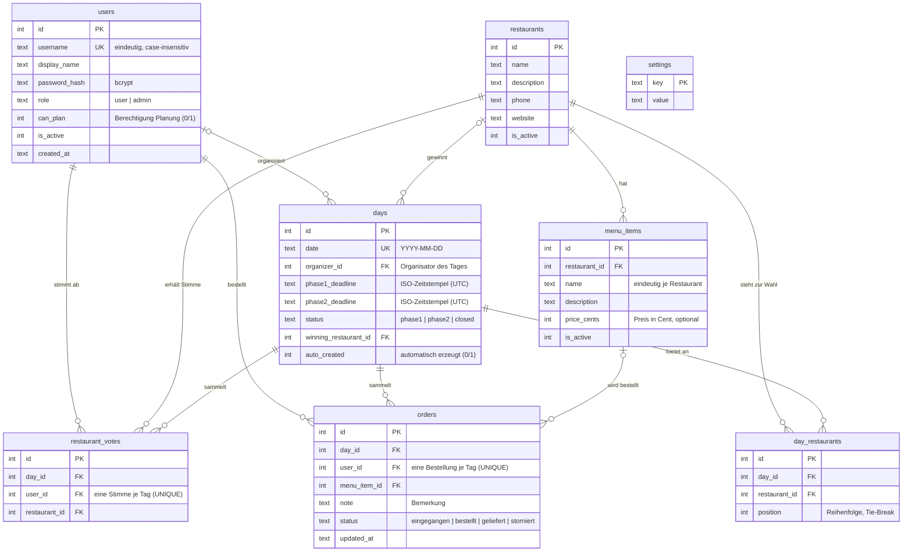

# Datenbankmodell

Die Anwendung verwendet **SQLite** (Datei `server/data/app.db`, wird beim ersten Start
automatisch angelegt). Das Schema liegt in [`server/src/db.js`](../server/src/db.js).

## ER-Diagramm



## Tabellen im Überblick

| Tabelle | Zweck |
| --- | --- |
| `users` | Benutzerkonten mit Rolle (`user`/`admin`) und dem additiven Flag `can_plan` (Berechtigung **„Planung"**: Tage anlegen/ändern/absagen und Planungs-Standardzeiten, aber keine Benutzer-/Restaurant-/Design-/SSO-Verwaltung). Nach außen erscheinen so drei Rollen: `user`, `planung`, `admin`. Die Organisator-Rolle ist keine globale Rolle, sondern eine **Zuweisung pro Tag** (`days.organizer_id`). |
| `restaurants` | Stammdaten der Restaurants/Lieferdienste. Statt harter Löschung werden verwendete Restaurants deaktiviert (`is_active = 0`), damit die Historie erhalten bleibt. |
| `menu_items` | Speisekarte je Restaurant, Preis in Cent (vermeidet Rundungsfehler). |
| `days` | Tagesplanung: Datum, Organisator, beide Deadlines, abgeleiteter Status und eingefrorener Gewinner. `auto_created = 1` kennzeichnet Tage aus der automatischen Planung; sie bleiben normal (manuell) bearbeitbar. |
| `day_restaurants` | Welche Restaurants an einem Tag zur Wahl stehen (`position` = Anzeige-Reihenfolge und Tie-Break bei Stimmengleichheit). |
| `restaurant_votes` | Phase-1-Stimmen. `UNIQUE (day_id, user_id)` erzwingt eine Stimme pro Person und Tag; erneutes Abstimmen ändert die Stimme (Upsert). |
| `orders` | Phase-2-Bestellungen. `UNIQUE (day_id, user_id)` erzwingt eine Bestellung pro Person und Tag; änderbar bis Bestellschluss. Status wird vom Organisator gepflegt. |
| `settings` | Key-Value-Einstellungen: Standard-Abstimmungszeiten/-Organisator-Modus für neue Tage sowie die Konfiguration der automatischen Tagesplanung (`auto_plan_config`, JSON). |

## Statuslogik (Phasenübergänge)

Der Tageszustand wird **aus den Deadlines abgeleitet** (nicht manuell geschaltet), siehe
[`server/src/dayLogic.js`](../server/src/dayLogic.js):

```
jetzt < phase1_deadline                     -> status = phase1   (Restaurantwahl)
phase1_deadline <= jetzt < phase2_deadline  -> status = phase2   (Essensauswahl)
jetzt >= phase2_deadline                    -> status = closed   (abgeschlossen)
```

* Beim Übergang zu Phase 2 wird der **Gewinner ermittelt und eingefroren**
  (`winning_restaurant_id`): meiste Stimmen, bei Gleichstand gewinnt die zuerst
  gelistete Option; ohne Stimmen die erste Option, damit Phase 2 immer stattfinden kann.
* Die Ableitung passiert bei jedem lesenden Zugriff **und** über einen Hintergrund-Job
  (alle 30 Sekunden), damit Übergänge auch ohne Traffic erfolgen.
* Ändert ein Admin die Deadlines nachträglich, wird der Status neu berechnet –
  eine Verlängerung von Phase 1 öffnet die Abstimmung also wieder.

## Migrationen

Schema-Änderungen laufen über ein additives Migrationssystem in
[`server/src/db.js`](../server/src/db.js): Der Stand wird in `PRAGMA
user_version` verfolgt, Migrationen ergänzen ausschließlich neue Spalten mit
sinnvollen Standardwerten (nicht-destruktiv) und laufen automatisch beim
Serverstart sowie explizit im Update-Skript. Bisherige Migrationen:

| Version | Inhalt |
| --- | --- |
| 1 | `restaurants.has_menu` (Restaurants ohne Speisekarte; Bestandsdaten: „ja“, wenn Gerichte hinterlegt sind) |
| 2 | `menu_items.category` und `menu_items.allergens` (Kategorien & Allergene, CSV-/URL-Import) |
| 3 | `days.organizer_mode` und `days.organizer_source` (Organisator-Modi: manuell/freiwillig/zufällig) |
| 4 | `orders.paid` (Bezahlt-Status) |
| 5 | `users.token_version` (serverseitige Token-Invalidierung bei Logout/Passwortänderung) |
| 6 | `users.can_plan` (Berechtigung „Planung": Tagesplanung ohne weitere Admin-Rechte) |
| 7 | `days.auto_created` (Kennzeichnung automatisch erzeugter Tage) |

## Zeitzonen

Alle Zeitstempel werden als **ISO-Strings in UTC** gespeichert. Das Frontend rechnet zur
Anzeige in die lokale Zeitzone des Browsers um. Serverseitig (z. B. „Welcher Tag ist
heute?“, Seed-Daten) gilt die Zeitzone `APP_TIMEZONE` (Standard: `Europe/Berlin`).
